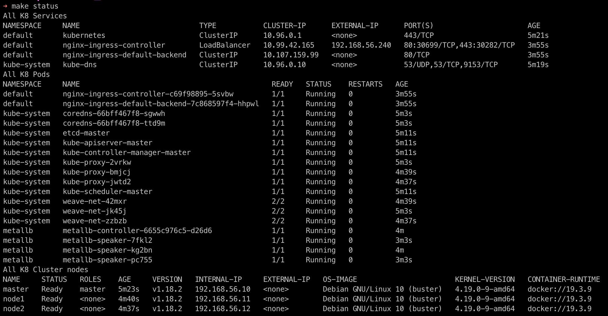
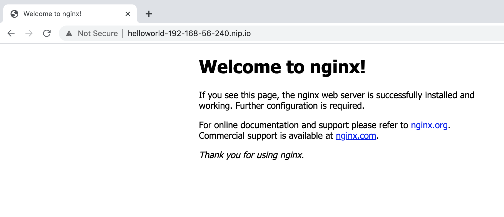

# k42s
<a id="markdown-k42s" name="k42s"></a>

>k42s is a full multinode Kubernetes Vagrant cluster with a real load balancer.

 

--------------------------------

<!-- TOC -->

- [Why “k42s”?](#why-k42s)
- [What is Kubernetes?](#what-is-kubernetes)
- [Features](#features)
- [Installation](#installation)
- [Usage example](#usage-example)
    - [Cluster services](#cluster-services)
    - [Demo service](#demo-service)
- [Advanced Usage](#advanced-usage)
- [Workshops](#workshops)
- [Release History](#release-history)
- [Meta](#meta)
- [Contributing](#contributing)

<!-- /TOC -->

## Why “k42s”?
<a id="markdown-Why%20%E2%80%9Ck42s%E2%80%9D%3F" name="Why%20%E2%80%9Ck42s%E2%80%9D%3F"></a>

This project is the result of getting my hands dirty with Kubernetes trying to fulfil my innate curiosity to
understand how things work in the nitty-gritty details. In the beginning I have started poking around with Minikube, which at that
time was quite convenient to run my experiments and demos. However, moving forward I have realised that
to have a holistic understanding of Kubernetes ecosystem I had to play with something near running it
in a real multinode production cluster where would possible to experiment with  network policies, load balancers,
ingress controllers, storage and more. Hence, I decided to build my own portable  Kubernetes lab and share it with the
world.


  This is by no means a Kubernetes production grade setup,
 do not expose ports, services, endpoints to the internet. 


## What is Kubernetes?
<a id="markdown-What%20is%20Kubernetes%3F" name="What%20is%20Kubernetes%3F"></a>

According to the official [website](https://kubernetes.io/docs/concepts/overview/what-is-kubernetes/):

_Kubernetes is a portable, extensible open-source platform for managing containerized workloads and services, that facilitates both declarative configuration and automation. It has a large, rapidly growing ecosystem. Kubernetes services, support, and tools are widely available._


## Features
<a id="markdown-Features" name="Features"></a>

Overlay network: [Weave](https://www.weave.works/docs/net/latest/overview/)

K8 Package management: [Helm](https://helm.sh)

Load LoadBalancer: [MetalLB](https://metallb.universe.tf/)

Service mesh: [Istio](https://istio.io)

Monitoring:  [Prometheus - Alert Manager ](https://prometheus.io) - [Grafana](https://grafana.com)

DNS Resolution: [Nip.io](http://nip.io/)

Vagrant base images and templates.

https://app.vagrantup.com/p0bailey/boxes/k8-stable

https://github.com/p0bailey/packer-templates/tree/master/k8


## Installation
<a id="markdown-Installation" name="Installation"></a>

**Requirements**

OS X & Linux:

- Ansible - https://www.ansible.com 
- Virtualbox - https://www.virtualbox.org
- Vagrant - https://www.vagrantup.com
- Heml - https://helm.sh - v3 :)
- k9s - https://github.com/derailed/k9s
- DirEnv - https://direnv.net

OSX:  `brew install ansible virtualbox vagrant helm derailed/k9s/k9s direnv kubectl`

**Other useful tools and plugins**

OSX: `brew install stern kubectx derailed/popeye/popeye`

**Setup**


## Usage example
<a id="markdown-Usage%20example" name="Usage%20example"></a>

**Quickstart:**

Make sure you add these StrictHostKeyChecking to your ~/.ssh/config otherwise Ansible likely to fail.

```
Host 192.168.56.*
   StrictHostKeyChecking no
   UserKnownHostsFile=/dev/null
```   

Clone the repo.

`git clone git@github.com:p0bailey/k42s.git`

Go into k42s directory and run.

`direnv allow`

`make bootstrap`

Those commands would set first a convenient KUBECONFIG env variable and second would bootstrap a full cluster with basic components as Istio, Prometheus, Weave-Scope.

At the end of the cluster bootstrap you must get this output showing 1 master and 2 worker nodes along with several pods.




### Cluster services
<a id="markdown-Cluster%20services" name="Cluster%20services"></a>


https://weave.192-168-56-240.nip.io

https://prometheus.192-168-56-240.nip.io

https://alertmanager.192-168-56-240.nip.io

https://grafana.192-168-56-240.nip.io

Grafana login admin/prom-operator

https://kiali.192-168-56-240.nip.io

Kiali login admin/admin

### Demo service
<a id="markdown-Demo%20service" name="Demo%20service"></a>

This deployment would provide a basic NGINX webserver.

Type: `make demo_1_install`

Expected output.
```
namespace/demo1 created
Release "demo1" does not exist. Installing it now.
NAME: demo1
LAST DEPLOYED: Tue Jun  2 11:24:43 2020
NAMESPACE: demo1
STATUS: deployed
REVISION: 1
NOTES:
1. Get the application URL going to:
 https://demo1.192-168-56-240.nip.io/

```




To delete demo 1 service type:

`make demo_1_delete`

Expected output.
```
release "demo1" uninstalled
namespace "demo1" deleted
```

Useful commands:

List all pods in all namespaces:

`kubectl get pods --all-namespaces`

List cluster events in all namespace sorted by creationTimestamp.

`kubectl get events --all-namespaces --sort-by=.metadata.creationTimestamp`

## Advanced Usage
<a id="markdown-Advanced%20Usage" name="Advanced%20Usage"></a>

[K42s advanced usage](docs/advanced-usage.md)

## Workshops
<a id="markdown-Workshops" name="Workshops"></a>

[Loads of self paced workshops to follow along](docs/workshops.md)


## Release History
<a id="markdown-Release%20History" name="Release%20History"></a>

See [CHANGELOG.md](CHANGELOG.md)

## Meta
<a id="markdown-Meta" name="Meta"></a>

Phillip Bailey– [@p0bailey](https://twitter.com/@p0bailey) – phillip@bailey.st

Distributed under the MIT license. See ``LICENSE`` for more information.

[https://github.com/p0bailey/k42s](https://github.com/p0bailey/k42s)

## Contributing
<a id="markdown-Contributing" name="Contributing"></a>

1. Fork it (<https://github.com/p0bailey/k42s>)
2. Create your feature branch (`git checkout -b feature/fooBar`)
3. Commit your changes (`git commit -am 'Add some fooBar'`)
4. Push to the branch (`git push origin feature/fooBar`)
5. Create a new Pull Request
