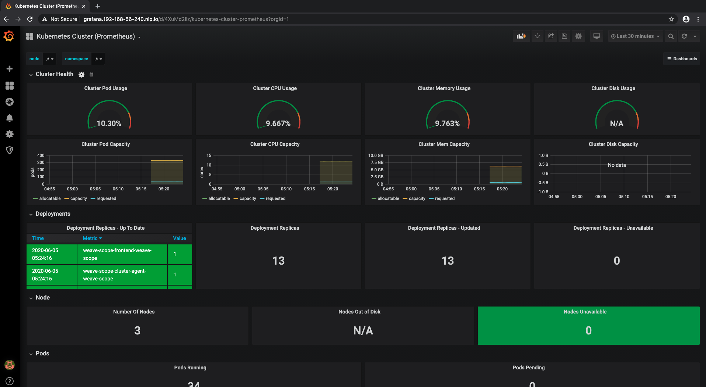
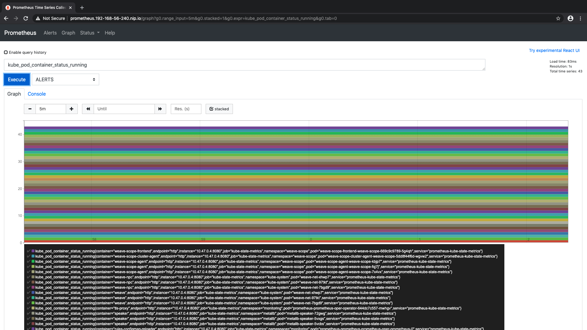
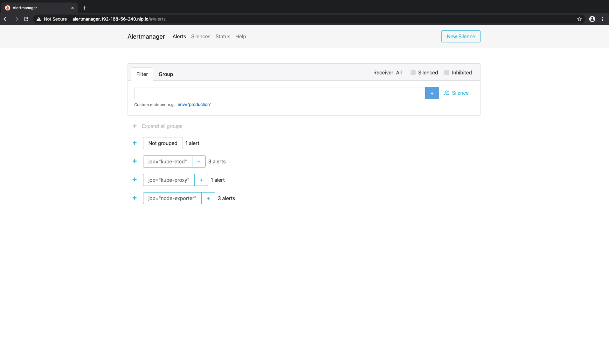
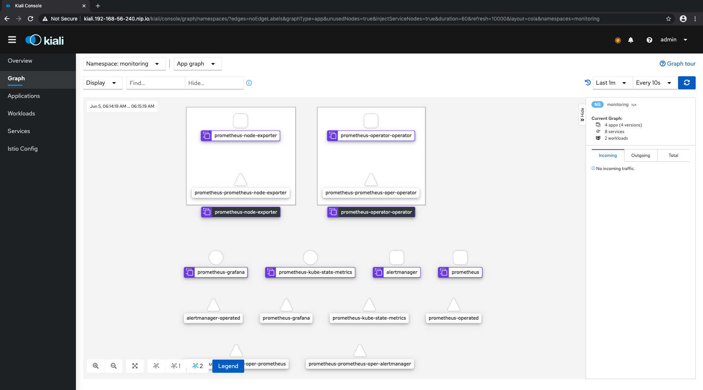
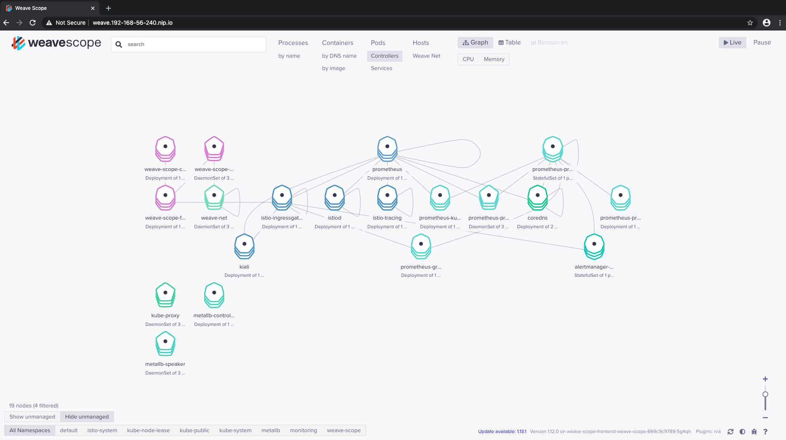

# Advanced usage
<a id="markdown-Advanced%20usage" name="Advanced%20usage"></a>

<!-- TOC -->

- [Cluster services](#cluster-services)
    - [Grafana](#grafana)
        - [Custom Grafana dashboards](#custom-grafana-dashboards)
    - [Prometheus](#prometheus)
    - [Alertmanager](#alertmanager)
    - [Kiali](#kiali)
    - [Weave-scope](#weave-scope)

<!-- /TOC -->

## Cluster services 
<a id="markdown-Cluster%20services%20" name="Cluster%20services%20"></a>

### Grafana
<a id="markdown-Grafana" name="Grafana"></a>
The tool for beautiful monitoring and metric analytics & dashboards. - https://grafana.com



To access Grafana open the endpoint in your browser. Expect and accept the self signed SSL/TLS invalid cert.

Grafana endpoint: https://grafana.192-168-56-240.nip.io

Grafana login: admin/prom-operator

#### Custom Grafana dashboards
<a id="markdown-Custom%20Grafana%20dashboards" name="Custom%20Grafana%20dashboards"></a>

Go to [prometheus-operator/values.yaml](../kubernetes/helm/charts/prometheus-operator/values.yaml) and in the Grafana block you can add any dashboard from Grafana official HUB.

```
# Automatically install these dashboards from the official Grafana dashboard hub
  dashboards:
    provisioned:
      istio-mesh-dashboard:
        gnetId: 7639
        datasource: Prometheus
      istio-performance-dashboard:
        gnetId: 11829
        datasource: Prometheus  
      istio-service-dashboard:
        gnetId: 7636
        datasource: Prometheus
      istio-workload-dashboard:
        gnetId: 7630
        datasource: Prometheus  
      kube-cluster:
        gnetId: 6417
        datasource: Prometheus
      new_dashboard_goes_here:
        gnetId: 1234
        datasource: Prometheus     
``` 

!!! After a new dashboard is added you have always re-deploy  Prometheus operator with:

`make prometheus_install`

### Prometheus 
<a id="markdown-Prometheus%20" name="Prometheus%20"></a>
An open-source monitoring system with a dimensional data model, flexible query language, efficient time series database and modern alerting approach. - https://prometheus.io/



To access Prometheus open the endpoint in your browser. Expect and accept the self signed SSL/TLS invalid cert.

Prometheus endpoint: https://grafana.192-168-56-240.nip.io


### Alertmanager
<a id="markdown-Alertmanager" name="Alertmanager"></a>
The Alertmanager handles alerts sent by client applications such as the Prometheus server. - https://prometheus.io/docs/alerting/alertmanager/


To access Alertmanager open the endpoint in your browser. Expect and accept the self signed SSL/TLS invalid cert.

Alertmanager endpoint:

https://alertmanager.192-168-56-240.nip.io

### Kiali
<a id="markdown-Kiali" name="Kiali"></a>

Kiali is a management console for Istio-based service mesh. It provides dashboards, observability. - https://kiali.io



To access Kiali open the endpoint in your browser. Expect and accept the self signed SSL/TLS invalid cert.

Kiali endpoint: https://kiali.192-168-56-240.nip.io

Kiali login: admin/admin


### Weave-scope
<a id="markdown-Weave-scope" name="Weave-scope"></a>

Weave Scope automatically generates a map of your application, enabling you to intuitively understand, monitor, and control your containerized, microservices-based application. - https://github.com/weaveworks/scope



To access Weave-Scope open the endpoint in your browser. Expect and accept the self signed SSL/TLS invalid cert.

Weave endpoint: https://weave.192-168-56-240.nip.io


